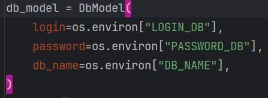
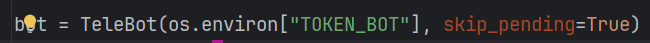
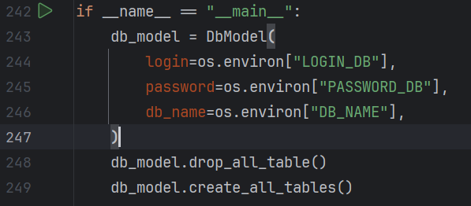
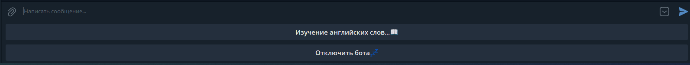

# Телеграмм бот с функцией обучения английскому языку

## Инструкция по работе бота

Для работы бота необходима организовать подключение к базе данных. В главном
модуле ```main_bot.py``` сразу после создания бота создается подключение к
базе данных, информация о которой подгружается из переменных окружения:

.

В том же модуле создается и сам бот - необходимый токен для него
подгружается также из переменных окружения, как и для БД:

.

Для создании схемы базы данных в папке ```docs``` имеется схема организации
БД и также sql запросы на создание таблиц и первоначальных данных. Но
использование этих данных не обязательно, так как для создания всех
необходимых таблиц и связей достаточно запустить первоначально модуль
```db_model```  из пакета ```database``` , который сам создаст все 
необходимые в БД таблицы и связи, а первоначальные данные бот 
заполнит сам:



    Обратите внимание, что для создание таблиц, данному модулю также 
    необходим доступ к переменным окружения, как и для описанного выше модуля 
    ```main_bot.py```.

Для запуска бота все подготовительные мероприятия выполнены, теперь
можно бот запускать. Запуск его осуществляется запуском главного
модуля ```main_bot```.

При работе, бот может находиться в двух
режимах: режим ожидания и режиме главного меню бота. При запуске приложения 
бот запускается в режиме ожидания. В
этом режиме он выполняет только поддерживаемые им команды (подробнее
смотреть
раздел ["поддерживаемые ботом команды"](#поддерживаемые-ботом-команды)), но
не обрабатывает никакие другие сообщения. Для перехода в 
режим главного меню из режима
ожидания необходимо ввести команду ```/start```. Вся дальнейшая навигация
выполнена абсолютно интуитивно с помощь кнопок клавиатур.

    Команды бот поддерживает только в режиме ожидания или в главном меню - в 
    других модулях команды будут не доступны.

Для перевода бота в режим ожидания, необходимо просто в главном меню нажать
кнопку "отключить бота":



Для остановки работы бота необходимо ввести команду ```/exit``` в главном
меню или в режиме ожидания бота, приложение будет остановлено или после
следующего сообщения боту, или само по прошествии короткого промежутка
времени, при этом всем пользователям, использующих в данный момент бота
прейдет уведомление что бот был отключен указанным пользователем.

## Поддерживаемые ботом команды

Работа с ботом организованна максимально интуитивно, вся навигация
по меню боту, после запуска его чата, осуществляется с помощью кнопок
клавиатур, также с помощью кнопок организована возможность завершения чата
с ботом с переводом его в режим ожидания.

Бот поддерживает 3 команды - все в нижнем регистре:

1) ```/start``` - предназначена для входа в главное меню бота любым
   пользователем;
2) ```/exit``` - нужна для остановки работы бота его администратором (пока
   данная команда работает с любым пользователем);
3) ```/help``` - выводит справку о доступных к использованию командах.


Команды бот поддерживает только в режиме ожидания или в главном меню - в 
других модулях и меню команды не доступны. (Чтобы начать чат с ботом 
находясь в режиме ожидания введите команду ```/start```).